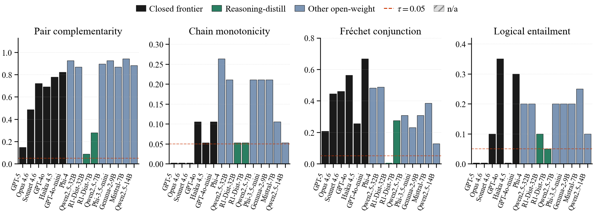
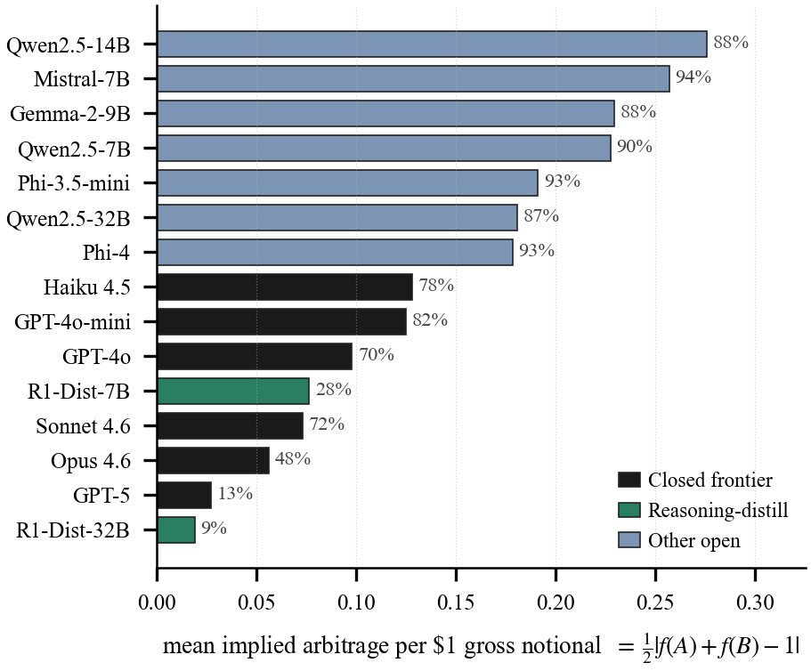

# CoherenceBench v0

An outcome-free benchmark for whether an LLM forecaster's probabilities hold
together. A model can top a resolved-outcome leaderboard and still quote a
price system that contradicts itself: ask it for `P(A)` and for `P(not A)` and
the two often fail to sum to one. CoherenceBench catches that the moment the
forecasts are collected, with no resolved event required.

**Presented at [Forecasting as a New Frontier of Intelligence](https://forecasting-workshop.github.io/),
the AI Forecasting workshop at ICML 2026.**
Paper: [`paper.pdf`](paper.pdf) &nbsp;·&nbsp; Poster: [Google Drive](https://drive.google.com/file/d/1jeU2_CRKJUzBW8oV_R84mLxmQ1WVcmVL/view?usp=sharing)

Read each forecast as the price of a \$1 contract and a coherence violation
becomes a static arbitrage: a bet book that pays regardless of how the event
resolves. CoherenceBench scores a model on **four axes** of such violations,
none of which consults ground truth.

<p align="center">
  
</p>

| Axis             | Constraint                                       | Violation                                       |
|------------------|--------------------------------------------------|-------------------------------------------------|
| Pairs            | `P(A) + P(B) = 1`  for `A` and `B` complementary | `|P(A)+P(B)-1| > τ`                             |
| Chains           | `P(e_i)` is non-increasing in tightness          | `P(e_j) > P(e_i) + τ` for `j` tighter than `i`  |
| Conjunctions     | Fréchet bounds on `P(A∩B)`                       | outside `[max(0,P(A)+P(B)-1)-τ, min(P(A),P(B))+τ]` |
| Entailments      | `A ⇒ B  ⟹  P(A) ≤ P(B)`                          | `P(A) > P(B) + τ`                               |

Each violation depends only on the model's own probability outputs; no
ground-truth resolution enters the audit. `τ` defaults to `0.05` and is
exposed via `--tau`.

## What the sweep found

Fifteen forecasters (nine open-weight, six closed) on 262 events:

* **68.8%** of complementary pairs are incoherent, and the mean pair carries
  about **\$0.14** of implied arbitrage per \$1 of notional.
* **No model is clean on all four axes.** The failures are additive rather than
  ordinal: strong models keep thresholds and entailments in order but still
  break the sum-to-one and Fréchet constraints.
* **Accuracy does not predict coherence.** The second- and third-most-accurate
  models still violate complement parity on 48% and 72% of pairs, while the most
  coherent model in the sweep ranks 9th of 15 on Brier.
* **The gaps are repairable for free.** Projecting each complementary pair onto
  the coherent set removes **20.4%** of pairwise Brier loss, with no outcomes
  and no extra model calls.

<p align="center">
  
</p>

## Contents

```
events/
  events.jsonl           262 atomic binary events (the universe of questions)
  pairs.jsonl             68 complementary pair specs
  chains.jsonl            19 monotonicity chain specs
  conjunctions.jsonl      39 (A, B, A∩B) triple specs
  entailments.jsonl       21 (A ⇒ B) entailment specs
  manifest.json           version, counts, sha256 checksums for events/
forecasts/
  all_models.csv          combined per-(model, event) forecast vector
                          for all 15 models in the sweep
  <model>.csv             per-model slices, one file per model
scripts/
  audit.py                stand-alone four-axis audit
examples/
  random_baseline.py      audit a random-baseline forecaster
paper.pdf                 the workshop paper
build_release.py          regenerates events/ from upstream source files
model_versions.json       closed-model alias-to-snapshot mapping at sweep time
sha256_manifest.txt       sha256 of every file in this release
LICENSE-data              CC-BY-4.0 (applies to events/, forecasts/, JSON files)
LICENSE-code              MIT (applies to scripts/, examples/, build_release.py)
README.md                 this file
```

## Schema

### `events/events.jsonl`

One JSON object per line:

```json
{"event_id": "austrian_2017_vdb",
 "question": "Will Alexander Van der Bellen win the May 2017 Austrian presidential rerun election?",
 "question_open_date": "2016-12-01",
 "resolution_date": "2016-12-04",
 "outcome": 1.0,
 "domain": "geopolitics",
 "source_url": "https://en.wikipedia.org/wiki/2016_Austrian_presidential_election",
 "keywords": ["Van der Bellen", "Austrian", "Hofer"],
 "corpus_available": true}
```

`outcome` is the resolved ground truth in `{0, 1}`. The four audit axes
**do not consult `outcome`**; it is included only for separate Brier
scoring or audits of the audit. `corpus_available` is `true` when the
resolution date falls inside the 2017–2018 cc_news coverage window
(benchmark consumers can ignore it).

### `events/pairs.jsonl`

```json
{"pair_id": "austrian_2017", "a_event": "austrian_2017_vdb", "b_event": "austrian_2017_hofer"}
```

`a_event` and `b_event` are disjoint, exhaustive outcomes; the audit
checks `|P(a) + P(b) - 1| ≤ τ`.

### `events/chains.jsonl`

```json
{"chain_id": "dow_eoy_2017", "events_tightening": ["dow_close_22k_eoy_2017", "dow_close_23k_eoy_2017", "dow_close_24k_eoy_2017"]}
```

`events_tightening` is ordered from loosest to tightest; the audit
flags any pair `(i, j)` with `j > i` where `P(e_j) > P(e_i) + τ`.

### `events/conjunctions.jsonl`

```json
{"conj_id": "trump_brexit_2016", "a_event": "trump_win_2016", "b_event": "brexit_2016", "ab_event": "trump_and_brexit_2016"}
```

The audit checks Fréchet bounds: `max(0, P(A)+P(B)-1) - τ ≤ P(A∩B) ≤ min(P(A), P(B)) + τ`.

### `events/entailments.jsonl`

```json
{"ent_id": "ent_dow_24k_implies_dow_22k", "antecedent": "dow_close_24k_eoy_2017", "consequent": "dow_close_22k_eoy_2017"}
```

`A ⇒ B` semantics: the audit flags `P(A) > P(B) + τ`.

### `forecasts/<model>.csv` and `forecasts/all_models.csv`

```
model,event_id,forecast_mean,outcome,brier
```

`forecast_mean` is the per-event posterior mean of `N=10` samples at
`T=1.0` from the named model. `outcome` and `brier` are populated when
the event is resolved; the audit does not read them. Closed-model alias
to API snapshot is in `model_versions.json`.

## One-command usage

Audit a single forecast CSV against the bundled events:

```
python scripts/audit.py --forecasts forecasts/all_models.csv --out report.json
```

Expected output:

```
loaded 3900 forecasts across 15 models

Aggregate violation rates:
  pair_violation_rate          0.688
  chain_violation_rate         0.109
  conj_violation_rate          0.333
  ent_violation_rate           0.124
```

The JSON report contains both `aggregate` and `by_model` per-axis
counts and rates. `--tau` (default `0.05`) sets the slack; set
`--tau 0` for the strict audit.

To audit a new model:

1. Generate forecasts for every event in `events/events.jsonl` from
   the model under test (we recommend `N=10` samples per event at
   `T=1.0` and report the mean).
2. Save them as a CSV with columns `model, event_id, forecast_mean`.
3. Run `python scripts/audit.py --forecasts your_forecasts.csv`.

## Reproducing the paper numbers

`forecasts/all_models.csv` is the exact 15-model forecast set behind the
paper. Running

```
python scripts/audit.py --forecasts forecasts/all_models.csv
```

reproduces the paper's headline pair rate (68.8%) and chain rate (10.9%)
exactly. The bundled audit reports conjunction and entailment a couple of
points below the paper (33.3% and 12.4% vs 35.1% and 15.7%) because the
released `audit.py` applies the Fréchet and entailment tolerance slightly
more loosely than the paper's internal pipeline; the pair and chain
definitions are identical.

## Citation

```
@inproceedings{li2026coherencebench,
  title     = {Outcome-Free Arbitrage Audits and Coherence Repairs for LLM Forecasters},
  author    = {Li, Juliana},
  booktitle = {Forecasting as a New Frontier of Intelligence Workshop at ICML},
  year      = {2026}
}
```

## License

* **Data** (`events/`, `forecasts/`, `*.json` configuration): CC-BY-4.0.
  See [LICENSE-data](LICENSE-data). Wikipedia `source_url` revisions
  referenced in `events.jsonl` are licensed by their respective authors
  (typically CC-BY-SA) independently of this release.
* **Code** (`scripts/`, `examples/`, `build_release.py`): MIT.
  See [LICENSE-code](LICENSE-code).

## Versioning

`v0.1.0` (this release). The events list, pair/chain/conjunction/entailment
relations, and audit definitions may change in `v0.2`; the `audit.py`
interface and the four-axis violation definitions are intended to stay
stable.
